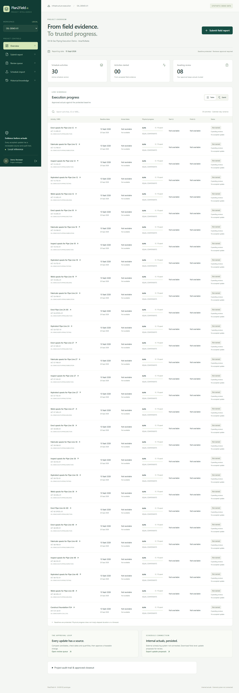

<div align="center">

# Plan2Field AI

**Turn field reports into verified schedule updates.**

Site evidence, AI activity matching and planner approval—connected to your Primavera workflow.


**[Live Prototype](https://plan2field-ai.vercel.app/projects/015eda49-574a-4a54-900f-2f2e7c0d8982) · [Demo Video](https://drive.google.com/file/d/1Rj64TK5jQotArFR2q2tse1xTsEL5AQAQ/view) · [Source Code](https://github.com/adithyadiwanad-sudo/plan2field-ai)**

**Team Avyakthra**

</div>

## The problem

- Field teams report work through site notes, spreadsheets, photos and voice recordings.
- Planners must translate those reports into the right schedule activities, dates and quantities.
- Inconsistent terminology, duplicate reports and missing context make progress updates difficult to verify.

Plan2Field AI addresses [SIH26122: Intelligent Data Capture & Schedule-Linking](https://www.sihbuddy.in/ps/SIH26122) by connecting field evidence to schedule activities while keeping the original baseline protected.

## How it works

```text
Field report → Extract work details → AI activity matching
                                           ↓
                                    Planner review
                                           ↓
                              Verified actuals → Export
```

- **Capture:** Submit text or spreadsheets, attach site photos and record GPS coordinates. Audio transcription uses a local Whisper adapter.
- **Match:** Find related activities using semantic search, then rerank candidates and check discipline, line number and work type.
- **Review:** Show the original report, suggested activities, scores and supporting evidence. Unmatched or uncertain reports stay in the review queue.
- **Approve:** Save verified progress with the planner's identity and an audit trail.
- **Export:** Download approved updates as CSV or JSON for downstream integration.


*Recorded dashboard using synthetic project data.*

## What it handles

- **Six disciplines:** Civil, Piping, Electrical, Mechanical, Instrumentation and HSSE.
- **Measured progress:** Start/finish dates, quantities and component completion. Three distinct spools out of ten means **30%**; reporting the same spool twice does not increase progress.
- **Evidence checks:** Photo previews, timestamps and GPS geofence status.
- **Delay tracking:** Delay reasons, planned-versus-actual date variance and immediate successor warnings.
- **Historical knowledge:** Recorded execution durations, recurring delay causes and discipline-specific comparisons.
- **Offline capture:** Keep pending reports on the device and sync when connected.
- **Role-based access:** Separate Field Engineer and Project Planner demo accounts.

## Built to protect the schedule

- Imported baselines remain **read-only**.
- AI can stage a proposal; **planner approval is required** before actuals and the export outbox change.
- Project permissions, version checks and repeat-safe requests protect against unauthorized or duplicate updates.
- Each accepted update retains its source evidence, reporter and approval history.

## Technology

- **Frontend:** React, Vite, Tailwind CSS v4 and Lucide.
- **Backend:** Express, TypeScript and a Python processing worker.
- **Matching:** Sentence-Transformers MiniLM **384-dimensional embeddings**, pgvector cosine search and a CrossEncoder reranker.
- **Database:** Neon PostgreSQL with protected baseline records and transactional approvals.
- **Audio:** Local Whisper speech-to-text adapter; site-noise accuracy remains to be evaluated.
- **Integration:** Bounded CSV/XER/XML imports and approved CSV/JSON exports. Native P6/MS Project sync is not yet connected; XER-style JSON is not a native `.xer` file.

## Research & validation

- The approach combines semantic matching with explicit engineering checks. Relevant research: [Nanduri & Delhi (2026), *Automated Schedule Enrichment from Daily Progress Reports: A Bi-Directional Neuro-Symbolic AI Approach*](https://doi.org/10.35490/EC3.2026.312).
- Recorded checks include frontend/backend builds, **26 JavaScript tests**, **28 Python tests**, and live PostgreSQL integration tests for permissions, baseline protection and approvals.
- Model scores are not calibrated confidence percentages. The included data is synthetic; operational accuracy and time savings require a field pilot.

## Run locally

Requires Docker with its Linux engine and Compose v2. From a fresh clone in PowerShell:

```powershell
git clone https://github.com/adithyadiwanad-sudo/plan2field-ai.git
cd plan2field-ai
Copy-Item .env.example .env
# Set private database passwords in .env before starting.
.\scripts\bootstrap.ps1 -DownloadModels
```

- Open **http://localhost:8080/login** and choose a demo role.
- Preserve an existing `.env`; the copy command is for a fresh setup.
- The Docker bootstrap is provided but has not been verified on a clean host. [Setup details](docs/setup-windows.md).

## Documentation

- **Technical report:** _Link to be added._
<!-- Paste the technical report URL above when ready. -->
- [Architecture](docs/architecture.md)
- [API reference](backend/openapi.yaml)
- [Demo walkthrough](docs/demo-script.md)
- [Verification records](docs/implementation-status.md)

---

**Built by Team Avyakthra.**
